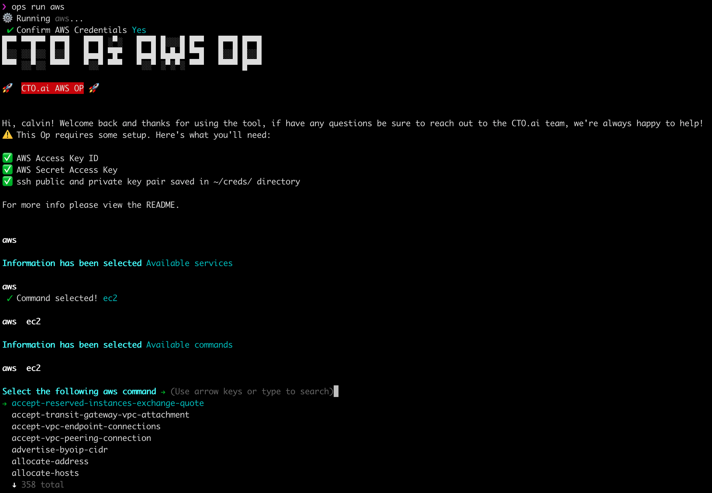

# 🛠 CTO.ai Interactive AWS CLI Op 🚀

A user-friendly interactive command line user interface to build and run an AWS CLI command.

## Requirements

To run this or any other Op, install the [Ops Platform.](https://cto.ai/platform). Find more information about how to run and build Ops via the [Platform Documentation](https://cto.ai/docs/overview)

This Op also requires credentials from AWS to run. Here's what you'll need before running this Op the first time:

- **AWS Access Key Id**: Generate via AWS Management Console > Security Credentials > Access Keys
- **AWS Access Key Secret**: Generate via AWS Management Console > Security Credentials > Access Keys

## Usage

Running `ops run aws`, gives you an interactive prompts to select AWS CLI commands.

## Available Commands 💡

To skip the service selection prompt you can run `ops run aws [service option]`. i.e. `ops run aws ec2`

For power users, the Op offers the option to entirely skip interactive prompts, by running `ops run aws [full command] [-p || --powermode]`.

## Local Development

To develop and run ops locally:

  1. Clone the repo `git clone <git url>`
  2. `cd` into the directory and install dependancies with `npm install`
  3. Run the Op from your local source code with `ops run path/to/op`

## Debugging Issues

Use `DEBUG=aws:* ops run aws` in order to run the op in debug mode

When submitting issues or requesting help, be sure to also include the version information output from `ops -v`

## Resources

### AWS

- [Getting Started on Amazon Web Services (AWS)](https://aws.amazon.com/getting-started/)
- [AWS CLI Command Reference](https://docs.aws.amazon.com/cli/latest/reference/)
